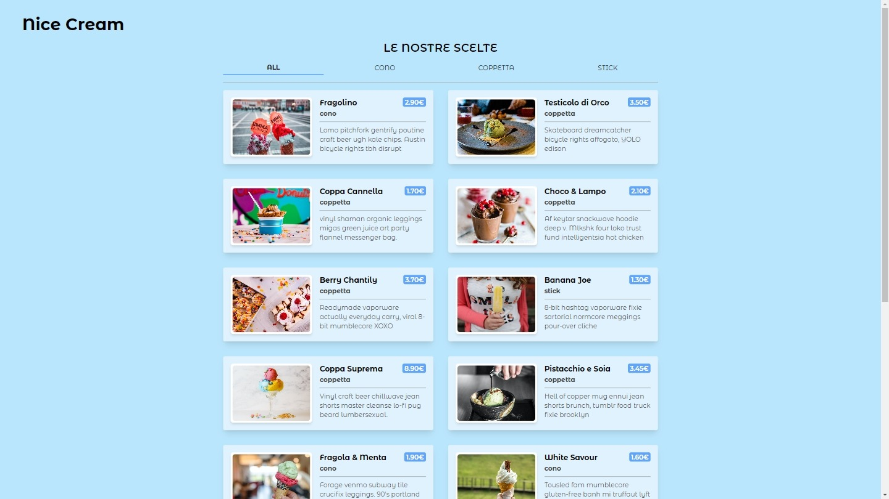
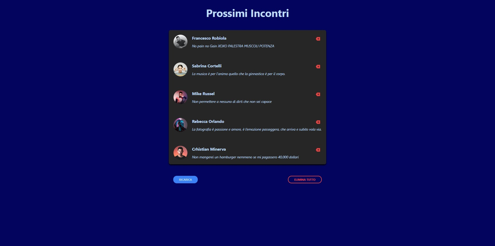
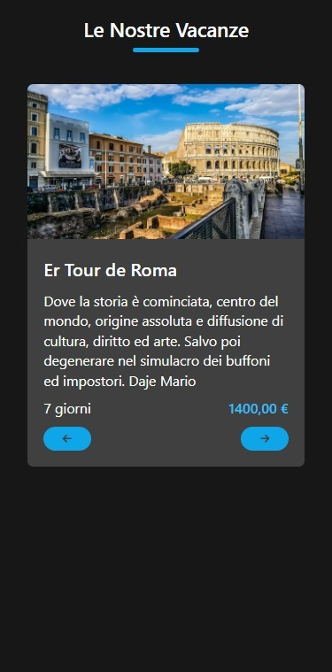
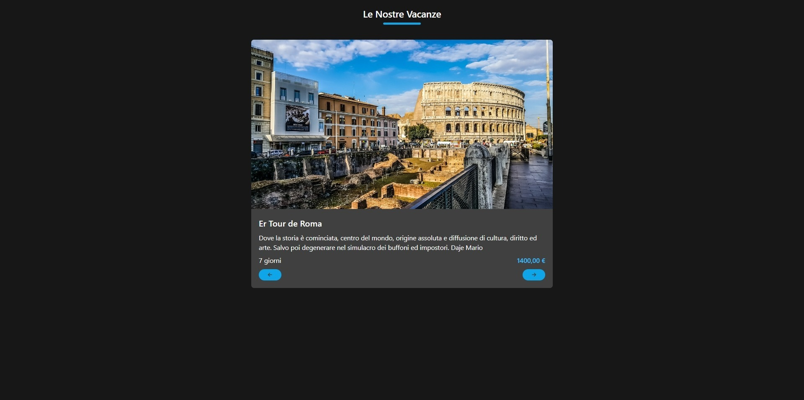
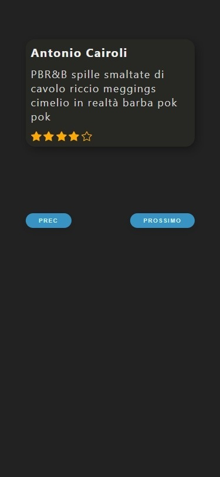
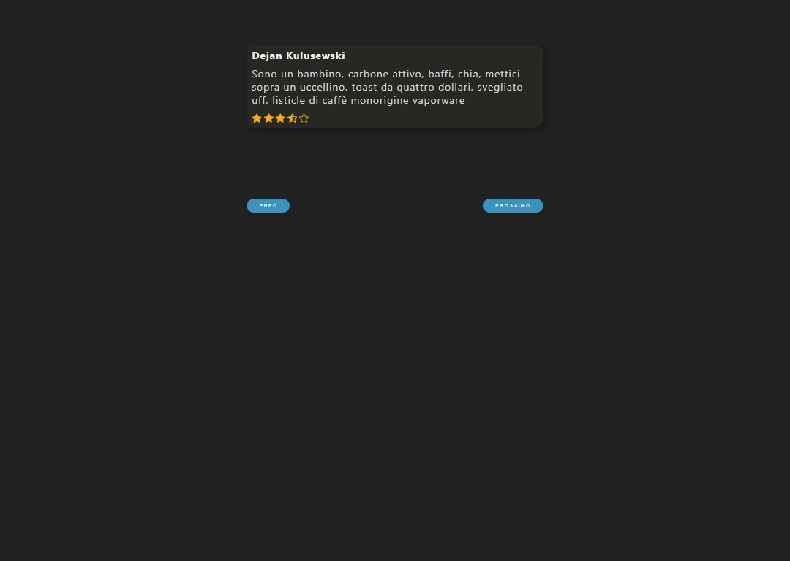
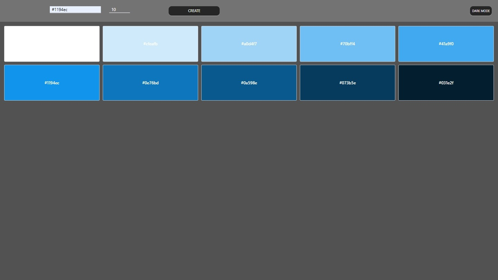
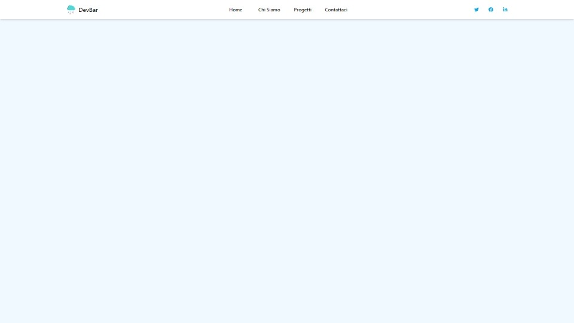
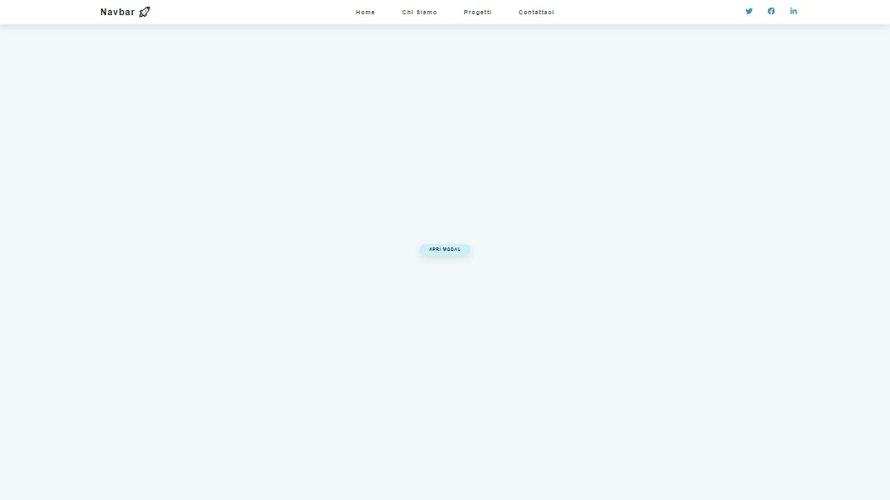
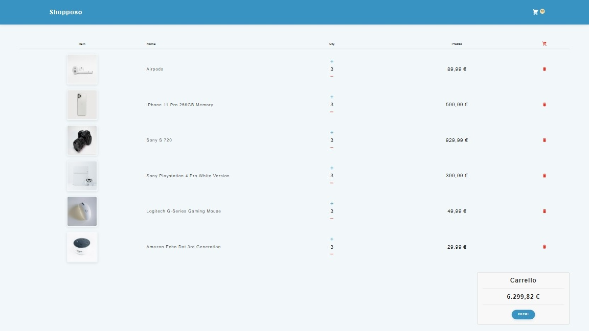

# React esercizi

- [In locale](#in-locale)
- [Sviluppo](#sviluppo)
- [Soluzioni](#soluzioni)
  - [Gelateria](#gelateria)
  - [Appuntamenti](#appuntamenti)
  - [Dark mode](#dark-mode)
  - [Vacanze](#vacanze)
  - [Slider](#slider)
  - [Generatore di sfumature](#generatore-di-sfumature)
  - [Navbar](#navbar)
  - [Sidebar](#sidebar)
- [Author](#author)

## In locale

- una volta scaricato la cartella principale ricorda di usare `cd inserisci-nome-progetto` che vuoi visualizzare.
- `npm install`
- `npm run dev`
- apri il tuo browser al [link](http://localhost:5173/) per visualizzare il progetto in locale.

In alternativa clicca sul nome del app che vuoi visualizzare.

## Sviluppo

Per questi progetti ho utilizzato:

- Bootstrap
- Tailwind css
- React+vite

## Soluzioni

### Gelateria

[App gelateria](https://gelateria-app.netlify.app/)

[Repository](https://github.com/Smailen5/react-esercizi/tree/main/gelateria)

---

### Appuntamenti

[App appuntamenti](https://app-appuntamenti.netlify.app/)

[Repository](https://github.com/Smailen5/react-esercizi/tree/main/appuntamenti)

---

### Dark mode

[Dark mode](https://app-dark-mode.netlify.app/)

[Repository](https://github.com/Smailen5/react-esercizi/tree/main/dark-mode)

---

### Vacanze

<!--  -->

[Vacanze](https://app-vacanze.netlify.app/)

[Repository](https://github.com/Smailen5/react-esercizi/tree/main/vacanze)

---

### Slider

<!--  -->

[Slider](https://app-slider.netlify.app/)

[Repository](https://github.com/Smailen5/react-esercizi/tree/main/slider)

---

# Generatore di sfumature

[Generatore di sfumature](https://shade-color.netlify.app/)

[Repository](https://github.com/Smailen5/react-esercizi/tree/main/color-grading)

---

### Navbar

[Navbar](https://dev-bar.netlify.app/)

[Repository](https://github.com/Smailen5/react-esercizi/tree/main/navbar)

---

### Sidebar

[Sidebar](https://stirring-caramel-6077da.netlify.app/)

[Repository](https://github.com/Smailen5/react-esercizi/tree/main/sidebar)

---

### Carrello

[Carrello](https://6687da577b536c479a070fbf--celebrated-llama-97d13f.netlify.app/)

[Repository](https://github.com/Smailen5/react-esercizi/tree/main/cart)

## Autore

[Git Hub](https://github.com/Smailen5)

[Linkedin](https://www.linkedin.com/in/smailen-vargas/)
