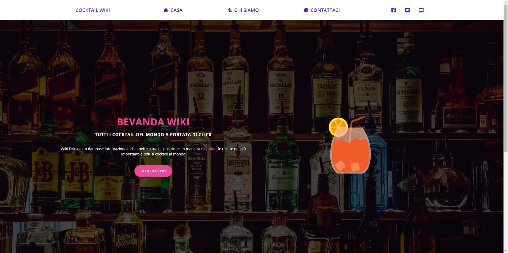

# React esercizi

- [Introduzione](#introduzione)
- [Badge](#badge)
- [Sviluppo](#sviluppo)
- [Soluzioni](#soluzioni)
  - [Gelateria](#gelateria)
  - [Appuntamenti](#appuntamenti)
  - [Dark mode](#dark-mode)
  - [Vacanze](#vacanze)
  - [Slider](#slider)
  - [Generatore di sfumature](#generatore-di-sfumature)
  - [Navbar](#navbar)
  - [Sidebar](#sidebar)
  - [Carrello](#carrello)
  - [Cocktail Wiki](#cocktail-wiki)
- [Author](#author)

### Introduzione

Questi progetti sono stati sviluppati durante un corso su React. L'obiettivo era familiarizzare con React e gli hook, nonché sperimentare diverse tecnologie e librerie utili nello sviluppo frontend. Ogni progetto è un esercizio per migliorare la mia comprensione e padronanza di React.
I progetti sono in ordine cronologico crescente, l'ultimo progetto e l'ultimo nella lista [Cocktail wiki](#cocktail-wiki)

### Badge

## Sviluppo

Per questi progetti ho utilizzato:

### Framework JavaScript

- React
- React Router 6
- styled-components 6.1.11
- styled-components 5.3.11

### UI Frameworks

- Tailwind CSS

### Miscellanea

- Vite
- LottieFiles
- PWA
- [Clippy](https://bennettfeely.com/clippy/) by [Bennett Felly](https://bennettfeely.com)
- [FormSpree](https://formspree.io/)

### CDN

- Netlify
- Cloudinary

### Strumenti di sviluppo

- styled-components 6.1.11
- styled-components 5.3.11

### JavaScript Libraries

- core-js 2.6.12

### PaaS

- Netlify

### Security

- HSTS

---

## Soluzioni

### Gelateria

[App gelateria](https://gelateria-app.netlify.app/)

[Repository](https://github.com/Smailen5/react-esercizi/tree/main/gelateria)

---

### Appuntamenti

[App appuntamenti](https://app-appuntamenti.netlify.app/)

[Repository](https://github.com/Smailen5/react-esercizi/tree/main/appuntamenti)

---

### Dark mode

[Dark mode](https://app-dark-mode.netlify.app/)

[Repository](https://github.com/Smailen5/react-esercizi/tree/main/dark-mode)

---

### Vacanze

[Vacanze](https://app-vacanze.netlify.app/)

[Repository](https://github.com/Smailen5/react-esercizi/tree/main/vacanze)

---

### Slider

[Slider](https://app-slider.netlify.app/)

[Repository](https://github.com/Smailen5/react-esercizi/tree/main/slider)

---

# Generatore di sfumature

[Generatore di sfumature](https://shade-color.netlify.app/)

[Repository](https://github.com/Smailen5/react-esercizi/tree/main/color-grading)

---

### Navbar

[Navbar](https://dev-bar.netlify.app/)

[Repository](https://github.com/Smailen5/react-esercizi/tree/main/navbar)

---

### Sidebar

[Sidebar](https://stirring-caramel-6077da.netlify.app/)

[Repository](https://github.com/Smailen5/react-esercizi/tree/main/sidebar)

---

### Carrello

[Carrello](https://6687da577b536c479a070fbf--celebrated-llama-97d13f.netlify.app/)

[Repository](https://github.com/Smailen5/react-esercizi/tree/main/cart)

---

### Cocktail Wiki

[Cocktail Wiki](https://sparkly-taffy-8ba942.netlify.app/)

[Repository](https://github.com/Smailen5/react-esercizi/tree/main/cocktail)

## Autore

[Git Hub](https://github.com/Smailen5)

[Linkedin](https://www.linkedin.com/in/smailen-vargas/)
